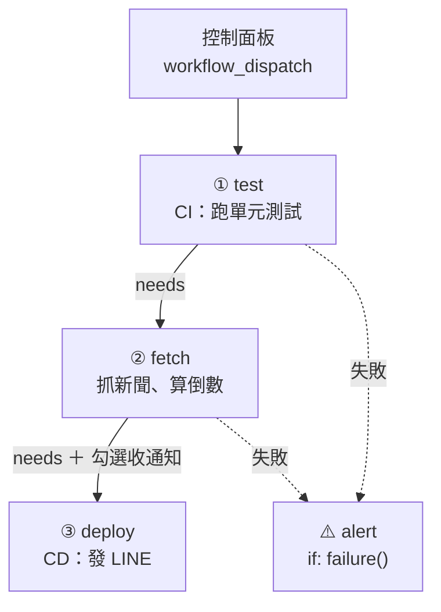

# 打造你的雲端小祕書：自動化入門-CI/CD 一鍵體驗

在 GitHub 網頁上輸入想追的演唱者，按一下 Run，看 CI/CD 流水線一格一格亮燈，手機收到 LINE 通知。全程不用改程式、不用裝任何東西。



## 怎麼玩

1. 用課堂上提供的 QR code 加入 LINE 官方帳號（12 人以上時由組長加入），會收到歡迎訊息，聊天室下方有選單。
2. 打開 **Actions → concert-news → Run workflow**，填欄位後按 **Run workflow**：

| 欄位 | 說明 |
|---|---|
| 想追的演唱者 | 必填，例如 `YOASOBI`、`Maroon 5` |
| 自己的 LINE 暱稱 | 會寫在通知裡，留空就顯示「匿名」 |
| 收 LINE 通知 | 勾選才發 LINE，沒勾只寫 Actions 摘要 |
| 假設今天是 | `YYYY-MM-DD`，留空就是今天 |
| 情境 | `正常`／`CI 測試失敗`／`資料來源失敗` |

3. 點進剛跑的那一筆，看流程圖和最下方的摘要。

## 一鍵體驗：同一條流水線跑兩次

| | 第 1 次：不勾通知 | 第 2 次：勾通知＋假設今天是 `2027-01-08` |
|---|---|---|
| ① test | ✅ | ✅ |
| ② fetch | ✅ 最新新聞＋演出倒數 | ✅ 最新新聞＋「明天演出」 |
| ③ deploy | ⏭ 灰色「已略過」 | ✅ 手機叮咚 |

## 收到的 LINE 卡片

- **倒數**：例如 `D-1`，旁邊是場地和開演時間。
- **提醒**：明天開賣、明天演出要做什麼。
- **📰 最新消息**：點標題就能看新聞。
- **🎫 前往購票**：有售票網址的場次才會出現。
- **⚙️ 查看這次的 CI/CD 執行**：直接打開這次的流程圖。
- 底部狀態列 `test ✅ → fetch ✅ → deploy ✅`，代表 CI/CD 全部通過才送到你手上。
- 流程失敗時改收**紅色卡片**，標題直接寫哪一步出問題（🧪 CI 測試沒過／📡 資料來源失敗），狀態列例如 `test ❌ → fetch ⏭ → deploy ⏭`，附「查看原因」按鈕。

## 三關：切換「情境」

| 關卡 | 情境 | 會看到 |
|---|---|---|
| 第 1 關・CI | `CI 測試失敗` | test 紅燈，後面全部略過：程式有問題，就不會部署出去 |
| 第 2 關・CD | `正常` | 一路綠燈；流程圖上的連線就是 `needs`，上一步做完才輪到下一步 |
| 第 3 關・防護 | `資料來源失敗` | fetch 紅燈、deploy 略過，alert 發 ⚠️ 警示 |

**寧可不發，也不要發錯；失敗不自動重跑。** 上游壞了，下游就停下來改發警示，由人看完、修好再手動執行。

## 示範資料

`concerts/` 放台灣場次的演出和開賣時間，用來算倒數：

| 演唱者 | 演出 | 場地 |
|---|---|---|
| Stray Kids | 2026-12-12 | 臺北大巨蛋 |
| YOASOBI | 2027-01-09、01-10 | 臺北大巨蛋 |
| Maroon 5 | 2027-01-24 | 高雄世運主場館 |
| BIGBANG | 2027-02-27、02-28 | 高雄世運主場館 |
| TXT | 2027-03-06、03-07 | 高雄（場館未公布） |
| Bruno Mars | 2027-05-01、05-02 | 高雄世運主場館 |

演出日期與場地以主辦單位公告為準。新聞來自 Google 新聞 RSS，連結給人自己點。

## 目錄

```
├── .github/workflows/concert-news.yml   # 流水線：test → fetch → deploy → alert
├── monitor_and_notify.py                # 抓新聞、算倒數、發 LINE（只用 Python 內建套件）
├── tests/test_monitor.py                # CI 用的單元測試，也檢查 concerts/ 的資料
├── concerts/                            # 演唱會資料
└── docs/
    ├── azure-pipelines.md               # GitHub Actions ↔ Azure Pipelines 對照
    ├── azure/azure-pipelines.yml        # 同一條流水線的 Azure Pipelines 版本
    ├── line-setup.md                    # 主講人：LINE 官方帳號、歡迎訊息、圖文選單、開場示範
    └── line/                            # 圖文選單圖片
```
