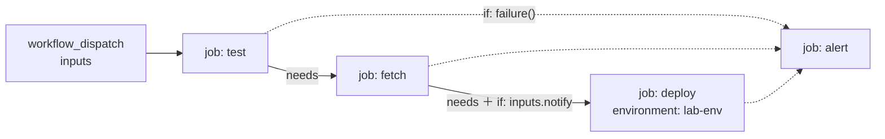
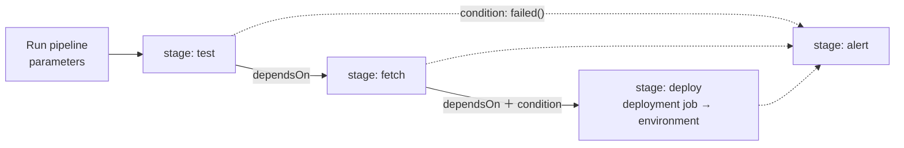

# GitHub Actions ↔ Azure Pipelines 對照

同一條流水線，兩個平台的寫法。概念都一樣：觸發 → CI → 資料管線 → CD，失敗就改發警示。

- GitHub Actions：[`.github/workflows/concert-news.yml`](../.github/workflows/concert-news.yml)
- Azure Pipelines：[`docs/azure/azure-pipelines.yml`](azure/azure-pipelines.yml)

## 流程圖

**GitHub Actions**：以 job 為單位，用 `needs` 串起來。



**Azure Pipelines**：以 stage 為單位，用 `dependsOn` 串起來。



在 Azure DevOps 執行後，pipeline 頁面也會畫出一樣的 stage 流程圖，跟 GitHub Actions 的流程圖對照著看。

## 概念對照

| 概念 | GitHub Actions | Azure Pipelines |
|---|---|---|
| 檔案位置 | `.github/workflows/*.yml` | repo 任意位置，建立 pipeline 時指定 |
| 手動觸發 | `on: workflow_dispatch` | `trigger: none`，在網頁按 Run pipeline |
| 輸入欄位 | `inputs`（`string`／`boolean`／`choice`） | `parameters`（`string`／`boolean`；用 `values` 做下拉選單） |
| 執行單位 | job | stage → job → step |
| 執行環境 | `runs-on: ubuntu-24.04` | `pool: vmImage: ubuntu-24.04` |
| 相依 | `needs: fetch` | `dependsOn: fetch` |
| 條件執行 | `if: inputs.notify` | `condition: eq('${{ parameters.notify }}', 'true')` |
| 失敗才跑 | `if: failure()` | `condition: failed()` |
| 傳值給下一步 | `GITHUB_OUTPUT` → `needs.fetch.outputs.message` | `##vso[task.setvariable;isOutput=true]` → `stageDependencies.fetch.fetch.outputs['fetchStep.message']` |
| 機密 | Environment secret | Library 的 variable group（或連結 Azure Key Vault） |
| 部署目標與核准 | `environment: lab-env` | `deployment` job ＋ `environment: lab-env` |
| 執行摘要 | `GITHUB_STEP_SUMMARY` | 看各 step 的 log |

## 逐段對照

### 觸發與輸入欄位

```yaml
# GitHub Actions
on:
  workflow_dispatch:
    inputs:
      artist:
        description: "想追的演唱者"
        required: true
        type: string
      notify:
        description: "收 LINE 通知"
        type: boolean
        default: false
      scenario:
        type: choice
        options: [正常, CI 測試失敗, 資料來源失敗]
```

```yaml
# Azure Pipelines
trigger: none
parameters:
  - name: artist
    displayName: 想追的演唱者
    type: string
  - name: notify
    displayName: 收 LINE 通知
    type: boolean
    default: false
  - name: scenario
    type: string
    default: 正常
    values: [正常, CI 測試失敗, 資料來源失敗]
```

### 相依與條件部署

```yaml
# GitHub Actions
deploy:
  needs: fetch
  if: inputs.notify
  environment: lab-env
```

```yaml
# Azure Pipelines
- stage: deploy
  dependsOn: fetch
  condition: and(succeeded(), eq('${{ parameters.notify }}', 'true'))
  jobs:
    - deployment: deploy
      environment: lab-env
```

GitHub 的 `if` 會自動加上「前面都成功」；Azure 的 `condition` 要自己寫 `succeeded()`，不然前面失敗了也會跑。

### 失敗警示

```yaml
# GitHub Actions
alert:
  needs: [test, fetch, deploy]
  if: failure()
```

```yaml
# Azure Pipelines
- stage: alert
  dependsOn: [test, fetch, deploy]
  condition: failed()
```

### 機密

```yaml
# GitHub Actions：Settings → Environments → lab-env → secret
env:
  LINE_CHANNEL_ACCESS_TOKEN: ${{ secrets.LINE_CHANNEL_ACCESS_TOKEN }}
```

```yaml
# Azure Pipelines：Library → variable group「lab-env」→ 鎖頭設為 secret
variables:
  - group: lab-env
# secret 變數不會自動變成環境變數，要在 step 明確對應
env:
  LINE_CHANNEL_ACCESS_TOKEN: $(LINE_CHANNEL_ACCESS_TOKEN)
```

## 同一支程式兩邊都能跑

`monitor_and_notify.py` 會判斷執行環境：

- 有 `GITHUB_OUTPUT`：寫進 GitHub Actions 的輸出。
- 有 `TF_BUILD`（Azure Pipelines 會自動設定）：印出 `##vso[task.setvariable ...]`。

程式和測試不用改，只有流水線的 YAML 寫法不同。
