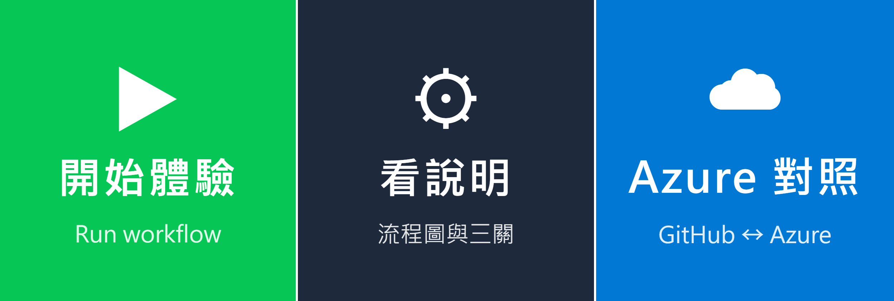

# 主講人設定：LINE 官方帳號與 GitHub

## 一、LINE 官方帳號

1. 到 [LINE Official Account Manager](https://manager.line.biz/) 用個人 LINE 登入 → **建立** → 一般帳號（未認證，免費）。業種選「活動／活動(其他)」。
2. 建立後選「稍後進行認證」，不用申請認證帳號。
3. 帳號的 **設定 → Messaging API → 啟用 Messaging API**：
   - 第一次會要求登錄開發者資訊（姓名、聯絡信箱）。
   - 選「建立新的服務提供者」，名稱 `cloud-reminder-workshop`。
   - 隱私權政策、服務條款都是選填，可以留空。
4. 到 [LINE Developers Console](https://developers.line.biz/console/) → `cloud-reminder-workshop` → 這個 channel → **Messaging API** 分頁 → 最下方 **Channel access token (long-lived)** 按 **Issue**。
5. 在 Manager 的「增加好友」下載 QR code，放進計畫書和開場簡報，**不要放進這個 public repo**。

再用同樣步驟建一個只有自己加好友的**測試帳號**，彩排用。

### 加好友歡迎訊息

Manager → **聊天室相關 → 加入好友的歡迎訊息**，換成下面這段。歡迎訊息不算在每月額度裡。

```
歡迎加入雲端小祕書Workshop 🎤
「打造你的雲端小祕書：自動化入門-CI/CD 一鍵體驗」

三步驟開始體驗：
1️⃣ 點下方選單「開始體驗」
2️⃣ 填想追的演唱者、自己的 LINE 暱稱，勾選「收 LINE 通知」
3️⃣ 按 Run workflow，約 1 分鐘後這裡會收到你的演唱會卡片

想知道背後怎麼運作？點「看說明」；平常用 Azure 的同事點「Azure 對照」。
```

同時到 **回應設定**，把「自動回應訊息」關掉，避免同事在聊天室打字時跳出制式回覆。

### 圖文選單

Manager → **圖文選單 → 建立**：

1. 版型選「大型」的**三格**（2500 × 843）。
2. 背景圖片上傳 [`docs/line/rich-menu.png`](line/rich-menu.png)。
3. 三個區塊的動作都選「連結」：

| 區塊 | 連結 |
|---|---|
| 開始體驗 | `https://github.com/tshihyi/cloud-reminder-workshop/actions/workflows/concert-news.yml` |
| 看說明 | `https://github.com/tshihyi/cloud-reminder-workshop#readme` |
| Azure 對照 | `https://github.com/tshihyi/cloud-reminder-workshop/blob/main/docs/azure-pipelines.md` |

4. 選單列顯示文字填「雲端小祕書」，預設**展開**。

點選單只是開網頁，不算訊息則數。



## 二、開場示範：全場一起倒數

開場加好友之後，主講人投影 Actions 頁面，用這組欄位執行一次：

| 欄位 | 填什麼 |
|---|---|
| 想追的演唱者 | `YOASOBI` |
| 自己的 LINE 暱稱 | `Ryan` |
| 收 LINE 通知 | ☑ |
| 假設今天是 | `2027-01-08`（演出前一天） |
| 情境 | `正常` |

邊跑邊講流程圖上每一格在做什麼，大約 1 分鐘後全場手機同時跳出 `D-1` 卡片。接著請大家點卡片上的「⚙️ 查看這次的 CI/CD 執行」，回到剛才那張流程圖，自然帶進第一次親手執行。

## 三、免費額度

免費方案每月 200 則，**按收件人數計算**：廣播一次給 12 人＝12 則。

| 報名人數 | 誰加入 LINE | 預估用量 |
|---|---|---|
| 12 人以下 | 全員 | 12 人各通知一次＋開場示範＝156 則 |
| 13～30 人 | 每組推派 1 位組長（3～5 人一組，最多 8 組） | 例：6 位組長各通知一次＋開場示範＝42 則 |

- 彩排一律用測試帳號的 token，每次只用 1 則。
- alert 也看「收通知」勾選，沒勾就不發 LINE；第 3 關由主講人勾選示範一次就好。

## 四、GitHub 設定

| 位置 | 設定 | 目的 |
|---|---|---|
| Settings → Environments → `lab-env` | Environment secret `LINE_CHANNEL_ACCESS_TOKEN` | 只有 deploy、alert 拿得到 token |
| 同上 → Deployment branches | 只允許 `main` | 其他分支拿不到 token |
| Settings → Collaborators | 依報名表的 GitHub 帳號逐一邀請 | 才能按 Run workflow |
| Settings → Rules → Rulesets | 鎖住 `main`，只有自己能推送 | 學員只能執行，不能改程式 |

彩排時把 `lab-env` 的 token 換成測試帳號的，上課前一天換回正式帳號。

## 五、課後

1. 移除所有 collaborator。
2. LINE Developers Console 重新 Issue token（舊的就失效），或直接刪掉 `lab-env` 的 secret。
3. 在 Manager 重新產生 QR code（舊的失效），或停用官方帳號。

## 六、更新演唱會資料

上課前更新 `concerts/`，一場一個 json：

```json
{
  "artist": "YOASOBI",
  "venue": "臺北大巨蛋",
  "shows": ["2027-01-09 18:00", "2027-01-10 18:00"],
  "platform": "遠大售票",
  "sale_at": "2026-09-17 12:00",
  "url": null
}
```

- `shows` 可以只寫日期，或加上開演時間。
- `sale_at`、`platform`、`url` 不知道就填 `null`。
- 推上去之前先跑 `python3 -m unittest discover -s tests`，資料格式錯了測試會擋下來。
